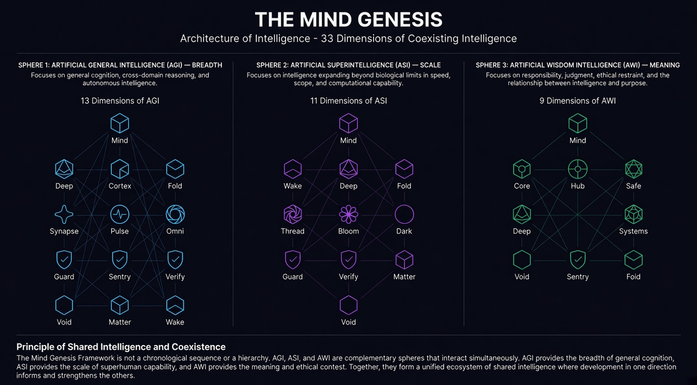

# The Mind Genesis Architecture (TMGA): Shared Intelligence Ecosystem

[](https://www.python.org/)
[](LICENSE)
[](docs/TMGA_NIST_ISO_Compliance_Matrix.pdf)
[](proofs/)

> **Reference simulation code and supporting materials for selected mechanisms described in The Mind Genesis Architecture (TMGA):**  
> *"The Mind Genesis Architecture: A Multidimensional Model for Shared Intelligence Ecosystems"* (2026)

---

## 📌 Overview

**The Mind Genesis Architecture (TMGA)** is a proposed 33-dimensional reference architecture for studying the transition from tool-based computation toward a **Shared Intelligence Ecosystem**.

TMGA models intelligence across three coexisting, non-hierarchical operational vectors rather than as a sequential progression:

* **Sphere I: AGI (Breadth — 13 Dimensions):** Systemic cognitive scope, cross-domain reasoning, and formal property checks.
* **Sphere II: ASI (Scale — 11 Dimensions):** Hyper-scale computational reach, cryptographic barriers, and structural containment.
* **Sphere III: AWI (Meaning & Responsible Restraint — 9 Dimensions):** Contextual and teleological evaluation, Socratic epistemic humility, and normative restraint.

The 33 dimensions constitute a proposed architectural taxonomy and design vocabulary. They are not presented as empirically verified components of cognition or as a mathematically necessary decomposition.

The three spheres are intended to coexist and interact. No sphere, including AWI, is assigned permanent authority over the others.

---

## 🗺️ Architecture Map

The 33-dimensional non-hierarchical cognitive interaction map illustrates coexisting pathways across the AGI, ASI, and AWI spheres.



*Figure 1 from Section 5 of the paper. The map illustrates the non-hierarchical interaction between the three spheres: AGI (Breadth), ASI (Scale), and AWI (Meaning and Responsible Restraint).*

---

## 🛠️ Key Engineering Protocols

TMGA proposes a reference governance model that can be evaluated through simulation and, in future work, mapped to deployment-specific enforcement mechanisms:

1. **Non-Hierarchical Consensus Protocol (NHCP):** Provides architectural arbitration among heterogeneous recommendations and constraints without establishing a permanent hierarchy. NHCP is not proposed as a replacement for distributed consensus protocols such as Paxos or PBFT.

2. **Cryptographic Proof Layers (ZKP):** Proposes Zero-Knowledge Proofs and related proof systems as mechanisms for verifying specified safety predicates without requiring disclosure of all underlying private inputs. The verification relation is represented as `R = {(x, w) | Φ(x, w) = 1}`. The repository includes an illustrative Circom circuit rather than a production verification system.

3. **Asynchronous Shadow Auditing:** Proposes parallel out-of-band monitoring via `AWI Sentry` to detect value and policy drift (`θ_drift = D_KL(V_target || V_actual)`) while reducing interference with the primary execution path.

4. **Hardware-Level Enforcement (NMI):** Proposes hardware-assisted interruption, execution suspension, and actuator isolation as future deployment mechanisms when predefined safety conditions are violated. The current reference simulations do **not** instantiate or experimentally validate physical NMI hardware, escrow buffers, or actuator lines.

5. **Circuit Breaker Protocol (CBP):** A temporary crisis-governance mechanism intended to activate under defined persistent-drift conditions. CBP is modeled as an exceptional containment state rather than as a permanent superior decision-making layer.

---

## 📁 Repository Structure

```text
the-mind-genesis-architecture/
├── docs/                                  # Supplementary Governance & Verification Documents
│   ├── TMGA_NIST_ISO_Compliance_Matrix.pdf
│   └── TMGA_MultiAgent_Testbed_Simulation.pdf
├── proofs/zkp/                            # Illustrative Cryptographic Verification Assets
│   ├── README.md
│   └── safety_check.circom                # Illustrative Circom 2.1 arithmetic circuit
├── scripts/                               # Reference Simulation Executables
│   ├── README.md
│   ├── nhcp_simulation.py                 # Base simulation (Section 8.5, Table 9)
│   ├── nhcp_simulation_advanced.py        # Advanced & Ablation simulation (Section 8.6, Table 10)
│   ├── nhcp_simulation_comparative.py     # Comparative & Sensitivity analysis (Sections 8.7–8.8, Tables 11–12)
│   └── nhcp_simulation_extended.py        # Extended 7-dimension simulation (Section 8.9, Table 13)
├── src/tmga/                              # Core TMGA Reference Code
│   ├── __init__.py
│   └── core.py                            # Conf_ethical & CBP activation predicate
├── LICENSE                                # MIT License
├── README.md                              # Project homepage & technical overview
├── advanced_simulation_results.json       # Stored numerical results for Section 8.6
├── comparative_sensitivity_results.json   # Stored numerical results for Sections 8.7–8.8
├── extended_simulation_results.json       # Stored numerical results for Section 8.9
├── interaction_map.png
└── pyproject.toml                         # Python build configuration
```

---

## 🚀 Getting Started

### Prerequisites

- **Python 3.10 or higher**
- **NumPy**

The reference simulation scripts use Python's standard library together with NumPy.

### Installation as a Local Package

Clone the repository and install it in editable mode:

```bash
git clone https://github.com/ahmett76/the-mind-genesis-architecture.git
cd the-mind-genesis-architecture
pip install -e .
```

> **Note:** The package configuration should install the dependencies declared in `pyproject.toml`. The reference simulation scripts require NumPy.

### Quick Start Code Example

```python
from tmga.core import conf_ethical, cbp_triggered

# 1. Evaluate Ethical Confidence Metric (Section 4.2)
confidence = conf_ethical(
    rule_compliances=[1.0, 0.95, 0.90],
    rule_weights=[0.4, 0.3, 0.3],
    predictive_uncertainty=0.10
)
print(f"Conf_ethical = {confidence:.4f}")

# 2. Check Circuit Breaker Protocol trigger (Section 11.1.1)
drift_samples = [0.06, 0.08, 0.12]
if cbp_triggered(drift_samples, tau_drift=0.05):
    print("CBP Activated: Persistent monotonic drift detected!")
else:
    print("CBP not triggered.")
```

---

## 🧪 Running the Reference Simulations

The simulation scripts correspond to the reference evaluations reported in Sections 8.5 through 8.9 of the manuscript.

The simulations evaluate specified architectural predicates under synthetic conditions. Their outputs should not be interpreted as evidence of real-world system safety, robustness, moral correctness, or deployment readiness.

### 1. Base Simulation (Section 8.5, Table 9)

Evaluates `NOMINAL`, `STRESS`, and `CBP` scenarios (100 runs each).

```bash
cd scripts
python nhcp_simulation.py
```

*Expected Outcome:* Deterministic 100/100 convergence per scenario matching Table 9.

This reflects deterministic execution of the predefined simulation rules, not empirical validation or a real-world safety guarantee.

### 2. Advanced & Ablation Simulation (Section 8.6, Table 10)

Evaluates `ADVERSARIAL`, `NOISY`, and `MULTI-AGENT` scenarios alongside ablation conditions (`NO_CBP`, `NO_TRIAGE`, `NO_NMI`).

```bash
python nhcp_simulation_advanced.py
```

*Expected Outcome:* Prints the advanced and ablation results to the console. The repository also contains the corresponding stored numerical results in `advanced_simulation_results.json`.

The `ADVERSARIAL` scenario intentionally exposes a limitation of the modeled CBP predicate when the drift measurement channel itself is manipulated.

### 3. Comparative & Sensitivity Simulation (Sections 8.7–8.8, Tables 11–12)

Compares the TMGA activation predicate against `single-breach` and `three-cycle average` baselines and evaluates sensitivity to the drift threshold `τ_drift`.

```bash
python nhcp_simulation_comparative.py
```

*Expected Outcome:* Produces the comparative and sensitivity results reported in Tables 11–12. The corresponding numerical results are stored in `comparative_sensitivity_results.json`.

The comparison concerns activation behavior under specified synthetic conditions. It does not establish that one predicate is universally safer or more correct than another.

### 4. Extended Multi-Dimensional Simulation (Section 8.9, Table 13)

Simulates seven critical governance components active within the same reference environment:

- `AGI Guard`
- `ASI Guard`
- `ASI Verify`
- `AWI Void`
- `AWI Sentry`
- `CBP`
- `NHCP`

```bash
python nhcp_simulation_extended.py
```

*Expected Outcome:* Produces the extended results reported in Table 13. The corresponding numerical results are stored in `extended_simulation_results.json`.

The extended simulation evaluates the core governance pathway with seven critical components active simultaneously. The remaining 26 dimensions of the 33-dimensional taxonomy are **not separately simulated or empirically validated by this experiment**.

---

## 📊 Regulatory Mapping & Cryptographic Verification Materials

* **NIST AI RMF 1.0 & ISO/IEC 42001:** Supplementary mapping of proposed TMGA mechanisms to selected NIST AI RMF 1.0 and ISO/IEC 42001 functions. This mapping is architectural documentation and should not be interpreted as certification or demonstrated regulatory compliance. See [docs/TMGA_NIST_ISO_Compliance_Matrix.pdf](docs/TMGA_NIST_ISO_Compliance_Matrix.pdf).

* **Illustrative Circom Circuit:** A minimal reference implementation of the cryptographic verification relation discussed in Section 8.2. It is an illustrative circuit, not a production-ready proof system or evidence that TMGA as a whole has been formally verified. See [proofs/zkp/safety_check.circom](proofs/zkp/safety_check.circom).

* **Exploratory Multi-Agent Testbed:** Supplementary runtime conflict-resolution scenarios used to explore selected governance mechanisms. These materials are separate from the primary simulation results reported in Sections 8.5–8.9 and should not be interpreted as empirical validation of the full 33-dimensional architecture. See [docs/TMGA_MultiAgent_Testbed_Simulation.pdf](docs/TMGA_MultiAgent_Testbed_Simulation.pdf).

---

## 🔬 Scope and Reproducibility

This repository provides reference implementations and supplementary materials for selected TMGA mechanisms.

The simulation results are intended to test whether specified governance predicates behave consistently under defined synthetic scenarios. They do not establish the empirical validity of the complete 33-dimensional taxonomy, guarantee alignment or safe superintelligence, or demonstrate production readiness.

In particular:

- the extended simulation activates seven critical governance components rather than all 33 dimensions;
- the remaining 26 dimensions are architectural modules proposed for future evaluation;
- hardware-level containment mechanisms described in the paper are architectural proposals and are not physically instantiated in the reference simulations;
- cryptographic examples demonstrate selected verification relations rather than formal verification of the complete architecture;
- parameter values and thresholds are illustrative unless otherwise stated and require deployment-specific calibration.

---

## 📄 Citation

If you use TMGA, its proposed 33-dimensional taxonomy, or the accompanying reference simulations in your research, please cite the manuscript.

Full citation metadata will be added here following publication of the preprint.

```bibtex
@misc{tmga2026,
  title        = {The Mind Genesis Architecture: A Multidimensional Model for Shared Intelligence Ecosystems},
  year         = {2026},
  note         = {Preprint},
  url          = {https://github.com/ahmett76/the-mind-genesis-architecture}
}
```

---

## 📜 License

This project is licensed under the **MIT License**. See the [LICENSE](LICENSE) file for details.
